# GreenLeaf Community Food Bank — Website

Repository for the GreenLeaf Community Food Bank website, built for WEDE5020W.
GreenLeaf is a **fictional non-profit organisation** created for this module; all
statistics, addresses, and contact details in the site are placeholders.

**Live structure:** 5 pages (Home, About Us, Our Services, Get Involved, Contact),
a shared header/nav/footer, an external stylesheet, and placeholder imagery with
responsive variants.

---

## Repository structure

```
GreenLeaf-Website/
├── README.md                  This file
├── index.html                 Home page
├── about.html                 About Us page
├── services.html              Our Services page
├── get-involved.html          Get Involved page (donate/volunteer/partner/request)
├── contact.html                Contact page
├── css/
│   └── style.css              External stylesheet (Part 2)
├── js/                         Reserved for Part 3 (functionality) — currently empty
├── images/                     Site images, including responsive 400w/800w variants
└── screenshots/                Breakpoint evidence (desktop/tablet/mobile), see below
```

---

## Part 2: CSS styling & responsive design

### What was implemented

**External stylesheet** — `css/style.css`, linked from every HTML page's `<head>`.
The file is organised into numbered sections (reset, variables, base styles,
typography, header/nav/footer layout, page-section layout, components, visual
styles, and two responsive breakpoints) with a comment banner at the top acting
as a table of contents.

**CSS reset & base styles** — a lightweight reset (box-sizing, margin/padding,
list style, table borders) so the site looks consistent across browsers, plus
site-wide defaults for font, colour, and line-height.

**Typography** — three type families used deliberately: Fraunces (serif) for
headings, Public Sans for body text, and IBM Plex Mono for schedule/table labels
and form labels, evoking hand-labelled pantry signage. Font sizes use `rem` and
`clamp()` so they scale with the user's browser settings rather than being fixed
in pixels.

**Layout (Flexbox + CSS Grid)** — Flexbox is used for every card/column layout
that needs to reflow as the number of items changes (the hero, stat cards,
service cards, values list, the 4 Get Involved forms, and the Contact page
columns), since `flex-wrap` combined with a `flex-basis` degrades predictably at
any width. CSS Grid with `grid-template-areas` is used for the footer's three
columns (address / contact / copyright), which is a fixed, named layout rather
than a variable list of cards — a better fit for Grid.

**Visual styles** — colour palette, background colours, borders, and box-shadow
on cards; `:hover`, `:focus`, and `:active` states on links, nav items, form
inputs, and the submit buttons.

**Responsive images** — every content photo now uses a `<picture>` element with
a `400w` file served on screens ≤640px and an `800w` file otherwise, instead of
one fixed-size image for all devices. Generated with Pillow, e.g.
`food-parcels-400w.jpg` / `food-parcels-800w.jpg`.

### Breakpoints used

| Breakpoint | Width | What changes |
|---|---|---|
| Desktop (default) | > 1024px | Multi-column layouts: hero side-by-side, 4-column stats, 3-column service cards, 2×2 Get Involved grid, 2-column Contact layout, 3-column footer |
| Tablet | ≤ 1024px | Stat cards and service cards drop to 2 columns; Get Involved and Contact stack to 1 column; spacing scale shrinks slightly |
| Mobile | ≤ 640px | Everything collapses to a single column; navigation stacks vertically instead of a row; base font size reduces slightly; wide schedule tables scroll horizontally inside `.table-scroll` instead of squashing |

### Screenshot evidence

Screenshots below were captured at 1440px (desktop), 768px (tablet), and 375px
(mobile) viewport widths. Full-size files are in `screenshots/`.

**Home — desktop / tablet / mobile**

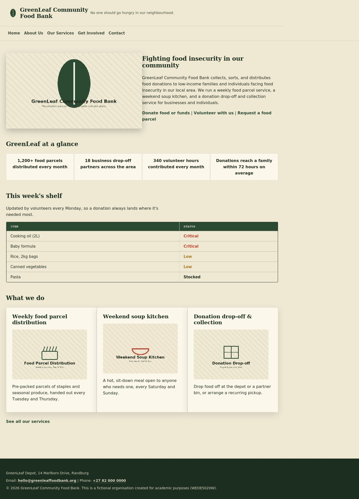
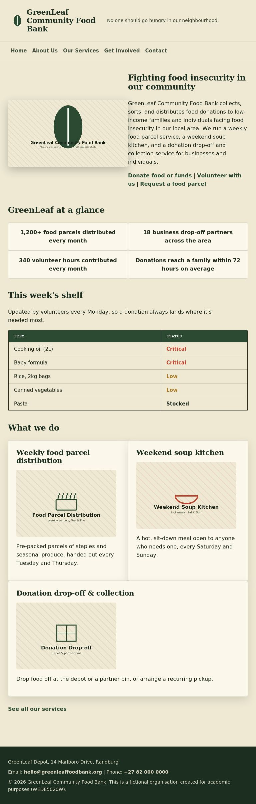
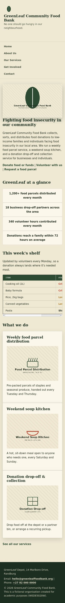

**Get Involved (4-form grid) — desktop / tablet / mobile**

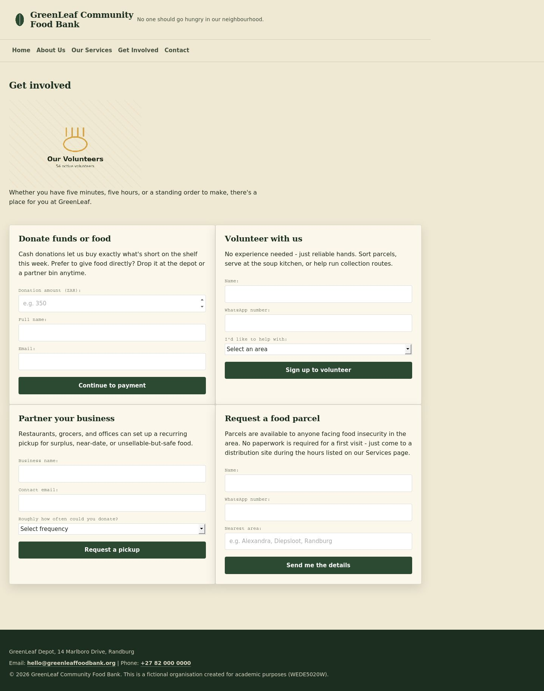
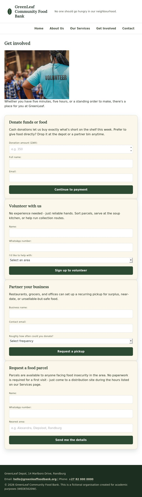
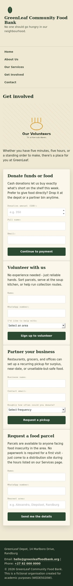

**Services (image + text rows, schedule tables) — desktop / tablet / mobile**

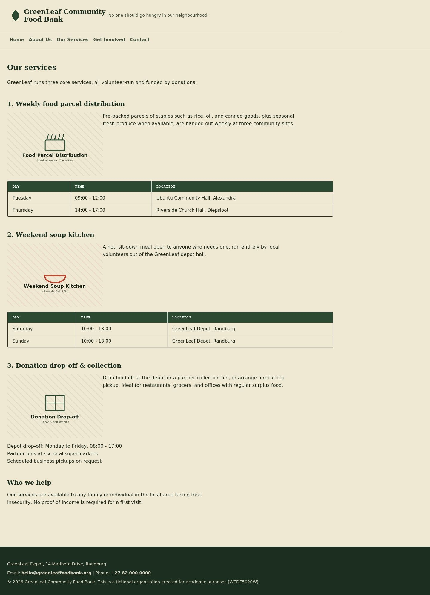
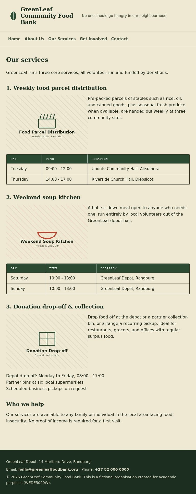
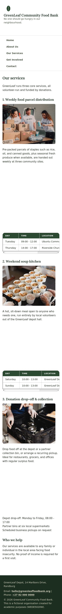

**About — desktop / mobile**

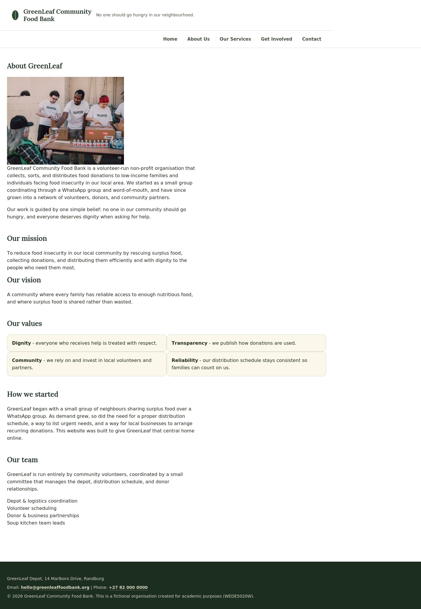
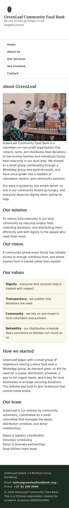

**Contact — desktop / mobile**

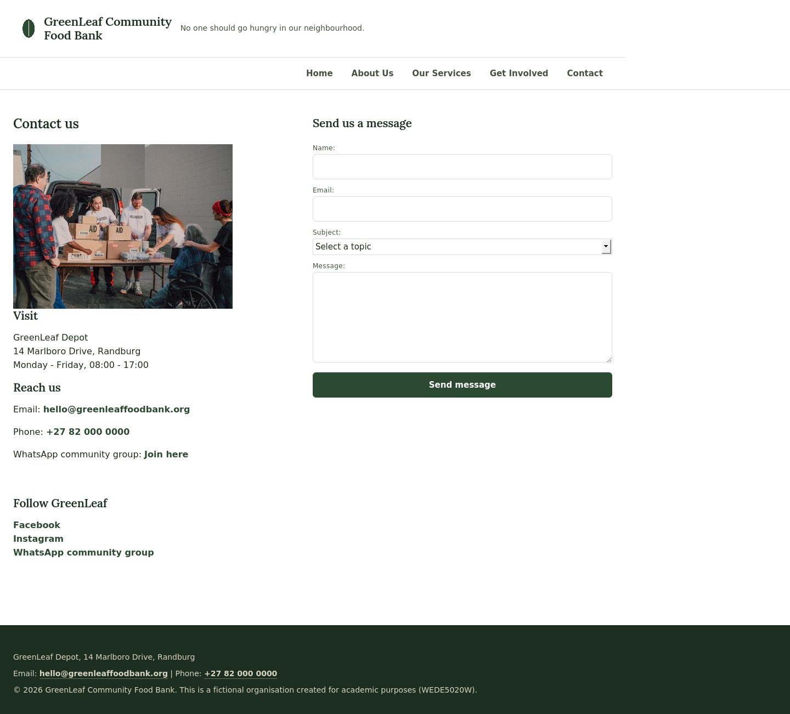
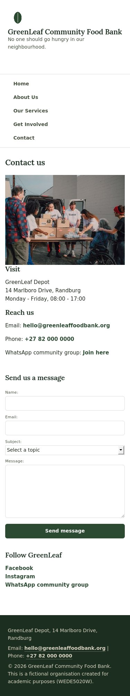

### A note on testing tooling

Screenshots were captured with a headless rendering tool during development.
While testing, that tool turned out not to support the `srcset` attribute on a
bare `` (it rendered a blank image), so every responsive image in the site
was standardised on a `<picture>` element instead, which is arguably the more
explicit and robust responsive-image technique in any case, and rendered
correctly in every test. This is noted here as part of the "test and iterate"
process rather than left silent. All current mainstream browsers (Chrome,
Firefox, Edge, Safari) support both `<picture>` and `srcset` fully.

---

## Changelog

This section is the module-required record of edits made in response to Part 1
feedback, plus new work delivered in Part 2. Newest entries first.

### [Part 2] — CSS styling, responsive design, README overhaul
- **Added** `css/style.css`, linked from all 5 HTML pages (previously the site
  had no CSS at all, per the Part 1 brief).
- **Added** a CSS reset and a design-token block (`:root` variables) for colour,
  type, and spacing, used consistently across every rule in the stylesheet.
- **Added** typography rules using three font families (Fraunces, Public Sans,
  IBM Plex Mono), loaded via Google Fonts, with `rem`/`clamp()` based sizing.
- **Added** Flexbox-based layouts for the hero, quick-facts stats, services
  preview cards, values list, the 4 Get Involved forms, and the Contact page
  columns; added a CSS Grid layout (`grid-template-areas`) for the footer.
- **Added** hover/focus/active visual states on navigation links, in-content
  links, form fields, and submit buttons.
- **Added** two responsive breakpoints (tablet ≤1024px, mobile ≤640px) with
  `@media` queries adjusting column counts, navigation layout, spacing, and
  base font size.
- **Changed** all content images to `<picture>` elements with `400w`/`800w`
  responsive variants (previously one fixed-size image per photo).
- **Changed** several HTML files structurally to support the new CSS layout:
  wrapped the 3 home-page service cards in `.service-cards`, wrapped the 4
  Get Involved forms in `.help-grid`, wrapped the Contact page's two sections
  in `.contact-grid`, wrapped each Services-page image/description pair in
  `.media-row`, and wrapped schedule tables in `.table-scroll` for horizontal
  scrolling on small screens. These were necessary additions to give the CSS
  something to lay out with Flexbox/Grid — Part 1 intentionally had no such
  wrapper elements since no styling was required yet.
- **Added** `screenshots/` folder with desktop/tablet/mobile evidence for 5
  pages, embedded above.
- **Fixed** a testing-tool issue where bare `` did not render in
  the headless screenshot tool used for evidence; standardised on `<picture>`
  instead (see "A note on testing tooling" above).
- **Rewrote** this README to document Part 2 work, add this Changelog section,
  and update References.

### [Part 1 corrections] — addressed after feedback
- Confirmed all 5 required pages (Home, About Us, Services, Get Involved,
  Contact) are present with consistent header/navigation/footer structure, as
  required by the brief.
- Confirmed images were appropriately sized (`width` attributes) rather than
  left at full native resolution, ahead of adding real responsive variants in
  Part 2.
- Carried forward the explanatory HTML comments added after Part 1 feedback,
  labelling each major structural feature (header, navigation, hero, "This
  week's shelf", services preview, forms, footer) directly in the markup.

### [Part 1] — initial submission
- Built the 5-page unstyled HTML structure (semantic header/nav/main/footer on
  every page) with placeholder images, per the Part 1 brief (no CSS required
  at that stage).
- Delivered the accompanying project proposal (Word document) and research
  folder (competitor analysis, target audience notes, content inventory, photo
  shot list) as required by the POE.

---

## References

Full citation detail for the research behind this project (target-organisation
analysis, personas, content planning) lives in the Part 1 proposal and research
folder submitted separately. Sources consulted for that research, in Harvard
style, all accessed 21 August 2026:

1. FoodForward SA (n.d.) *About Us*. Available at:
   https://www.foodforwardsa.org/about-us/

2. Global FoodBanking Network (2024) *How FoodForward SA Grew Into the Largest
   Food Bank in Sub-Saharan Africa: A Q&A with Andy Du Plessis*. 20 December.
   Available at:
   https://www.foodbanking.org/blogs/foodforward-sa-largest-food-bank-on-the-african-continent-qa-with-andy-du-plessis/

3. FoodForward SA (n.d.) *Home*. Available at: https://foodforwardsa.org/home/

4. FoodForward SA (n.d.) *Donate Food*. Available at:
   https://www.foodforwardsa.org/donate-food/

5. FoodForward SA (n.d.) *Welcome to Food Forward SA*. Available at:
   https://foodforwardsa.org/welcome/

6. Ladles of Love (n.d.) *About Our Charity*. Available at:
   https://ladlesoflove.org.za/about/

7. Ladles of Love (n.d.) *Soup Kitchens for the Homeless*. Available at:
   https://ladlesoflove.org.za/projects/soup-kitchens/

8. News24 (2026) *One of SA's biggest child feeding schemes was once a small
   Cape Town soup kitchen*. 25 May. Available at:
   https://www.news24.com/life/food/news/one-of-sas-biggest-child-feeding-schemes-was-once-a-small-cape-town-soup-kitchen-20260525-0352

9. Wander Cape Town (2023) *Interview with Danny Diliberto, CEO of Ladles of
   Love*. 29 October. Available at:
   https://wandercapetown.com/local-knowledge/interviews/danny-diliberto-ladles-of-love/

New references added for Part 2 (CSS, responsive design, and testing
practices):

10. Mozilla Developer Network (n.d.) *CSS Flexible Box Layout*. Available at:
    https://developer.mozilla.org/en-US/docs/Web/CSS/CSS_flexible_box_layout
    (Accessed: 16 September 2026).

11. Mozilla Developer Network (n.d.) *CSS Grid Layout*. Available at:
    https://developer.mozilla.org/en-US/docs/Web/CSS/CSS_grid_layout
    (Accessed: 16 September 2026).

12. Mozilla Developer Network (n.d.) *Responsive images*. Available at:
    https://developer.mozilla.org/en-US/docs/Web/HTML/Guides/Responsive_images
    (Accessed: 16 September 2026).

13. Mozilla Developer Network (n.d.) *Using media queries*. Available at:
    https://developer.mozilla.org/en-US/docs/Web/CSS/CSS_media_queries/Using_media_queries
    (Accessed: 16 September 2026).

14. Google Fonts (n.d.) *Fraunces, Public Sans, IBM Plex Mono*. Available at:
    https://fonts.google.com/ (Accessed: 16 September 2026).

15. WEDE5020W Part 2 Guide, module handout (course lecturer, 2026).

---

## How to preview locally

1. Clone or download this repository.
2. Open `index.html` directly in a browser, **or** for the best experience
   (correct relative paths, live reload while editing), use VS Code with the
   Live Server extension: right-click `index.html` → *Open with Live Server*.
3. Resize the browser window (or use DevTools' device toolbar) to see the
   tablet and mobile layouts described above.

## Next phase (Part 3, not yet implemented)

The `js/` folder is reserved for Part 3 functionality: form validation,
interactive navigation, and any client-side behaviour the module requires.
Forms currently use `action="#"` and do not submit anywhere yet.
